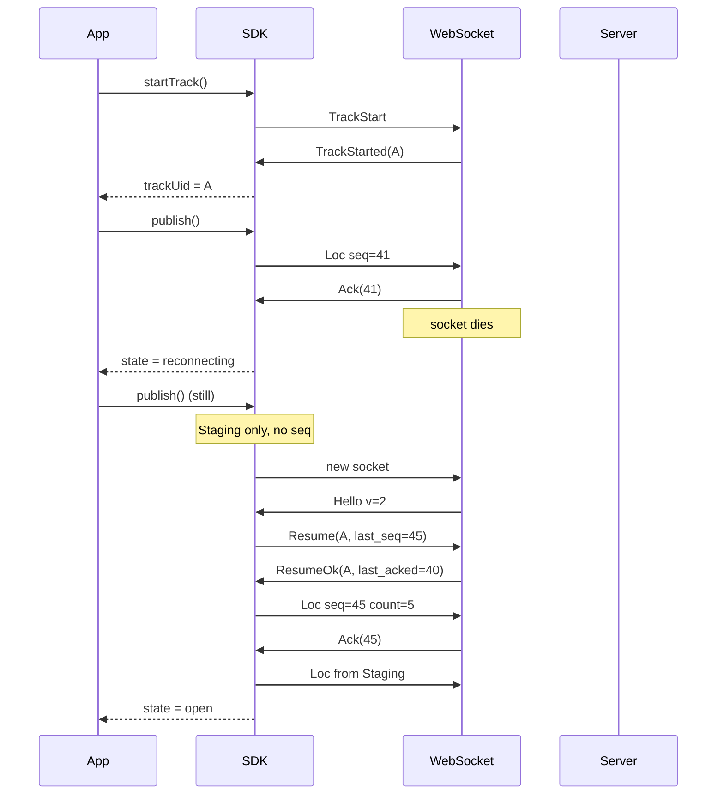

# WebSocket session and reconnect

This is the behavioural spec. Byte layouts are in [wire.md](wire.md). The GPS filter is in [filter.md](filter.md).

The hard rule: **a dropped socket is not a new trip.** If the SDK still has a `track_uid`, it **Resumes**. It must not send `TrackStart` just because TCP died.

The application never calls Resume. That is SDK-internal.

---

## 1. What you are looking at

Two roles share `wss://tracking.pickpoint.io/v2/ws`:

| | Device | Listener |
|--|--------|----------|
| Auth | `client-id` + `client-secret` | `access-token` |
| After Hello | `TrackStart` or `Resume` | `Subscribe` per device |
| After a drop | Hello → **Resume** if `track_uid` set | Hello → **Subscribe** again |
| Live GPS on WS | send `0x04 Loc`, get `0x85 Ack` | receive `0x86 Loc` |
| Offline GPS | RAM Staging (below) | nothing to buffer |

Listeners **do not** resume a track cursor. They never get the offline trail as a live replay. History is HTTP.

---

## 2. First connection (device) — no Resume

```
app: connect({ endpoint, auth: device, reconnect: true })
        │
        ▼
   TCP + TLS + WS upgrade   (subprotocol tracking.v2)
        │
        ▼
   0x80 Hello  version=2     SDK checks version, state = open
        │
        ▼
app: startTrack({ location, route?, metadata? })
        │
        ▼
   0x02 TrackStart  ─────────►  server creates track B
   ◄──── 0x83 TrackStarted      SDK stores track_uid  (in RAM only)
        │
app: publish({ lat, lng, … })   // many times
        │
        ▼
   filter → seq → 0x04 Loc ──►  server last_acked = seq
   ◄──── 0x85 Ack(seq)
```

Until `TrackStarted` (or `ResumeOk`) the SDK must not send `Loc`. `publish()` before that is invalid.

`close()` from the app: do **not** Resume afterwards. The track stays on the server until `TrackStop` or the idle job. This session is finished.

---

## 3. Why there are two RAM lists (device SDK)

Raw GPS is noisy and can be 50 Hz. Seq is scarce (it is the durable cursor). So the SDK does **not** number every chip sample.

```
GPS sample
    │
    ▼
NoiseFilter          [filter.md]  ~1 Hz + vertices
    │
    ▼
Staging              filtered points, **no seq yet**, RAM
    │                only while we cannot send (socket down, or window full)
    ▼
assign seq           last_assigned_seq += 1  (or +count for a batch)
    │
    ▼
InFlight             {seq, point} waiting for Ack
    │
    ▼
0x04 Loc on WS
    │
    ▼
0x85 Ack(seq)        drop InFlight where seq <= ack
```

Terms:

| Name | What |
|------|------|
| **Staging** | Filtered points that have not been given a seq. Offline GPS lands here. |
| **InFlight** | Already sent (or about to send), waiting for `Ack`. Still has seq. |
| **last_assigned_seq** | Highest seq this SDK has handed out. This is what `Resume.last_seq` is. |
| **last_acked** | Server cursor. The SDK learns it from `Ack` and from `ResumeOk`. |

There is **no** third “chunk store”. A `Loc` with `count=N` is just how you slice Staging/InFlight at send time.

Cap: **10_000** points total across Staging+InFlight (a point is in one list, not both). Overflow: collapse collinear samples in the **middle**, keep the newest. No disk in this spec.

Window: at most **8** `Loc` frames without an `Ack`, then wait.

Coalesce: if the filter emits faster than ~5 Hz, the SDK may wait 20–50 ms and send `count>1`. At 1 Hz do not delay.

---

## 4. Online vs offline (device)

**Socket OPEN**

1. Filter emits a point (or a small coalesce batch).
2. Assign seq(s), append to InFlight, send `Loc`.
3. `Ack(N)` removes InFlight `seq <= N`.

**Socket down** (`reconnecting`)

1. `publish()` still runs the filter.
2. Results go to **Staging only**. Seq is **not** incremented.
3. InFlight is left as-is (those seqs may or may not have reached the server).

---

## 5. Reconnect — the actual WS sequence

Assume the app already called `startTrack()`, `track_uid = A`, and `reconnect: true`.

### 5.1 Socket dies

Typical causes: LTE flap, laptop sleep, load balancer idle timeout, Relocate, process of the old node gone.

SDK:

1. `state = reconnecting` (app event). Do not call `startTrack()`.
2. GPS → Staging.
3. Backoff (exponential; jitter). Do not hammer Hello.
4. Open a **new** WS to the same URL (or the Relocate endpoint), same auth, subprotocol `tracking.v2`.

### 5.2 New socket, Hello, Resume

```
        new WS
          │
          ▼
     0x80 Hello  version=2
          │
          ▼
     0x01 Resume
          track_uid = A
          last_seq  = last_assigned_seq     // e.g. 45
          │
          ▼
     wait for 0x82 ResumeOk  or  0x88 Error  or  0x81 Relocate
```

`Resume.last_seq` means “I have numbered up to 45”. It is **not** an instruction to set the server cursor. The server looks at L1 / store and answers with **its** `last_acked`.

### 5.3 ResumeOk — flush

Example: server had `last_acked = 40`, client had assigned 45, Staging has 250 filtered points.

```
◄── 0x82 ResumeOk  track=A  last_acked=40

SDK:
  ackThrough(40)          // InFlight 1..40 gone
  InFlight left = 41..45  // sent before the drop, server never got them
  bind active_track = A   // following Loc frames have no uid

──► 0x04 Loc  seq=45 count=5     // points 41..45 (first abs, rest Δ)
◄── 0x85 Ack  45

  Staging → assign 46, 47, …     // now we burn seq
──► 0x04 Loc  seq=145 count=100  // 46..145
──► 0x04 Loc  seq=245 count=100
──► 0x04 Loc  seq=295 count=50
◄── 0x85 Ack  …
```

Same `0x04 Loc` as live. There is no “flush” / “batch” / “replay” message type.

If `Ack` for 41..45 was actually applied on the server but the client never saw `Ack`: `ResumeOk.last_acked` would already be 45, `ackThrough` empties InFlight, those five points are **not** resent. If they are resent anyway, `seq <= last_acked` is a no-op and the server still `Ack`s.

### 5.4 Resume errors

| Server frame | SDK |
|--------------|-----|
| `ResumeOk` | Flush as above. `state = open`. |
| `TRACK_NOT_FOUND` (A finished, idle-job, superseded, wrong uid) | **Fatal.** Clear `track_uid`, Staging, InFlight. App must `startTrack()` if it still wants a trip. |
| `AUTH` / `UNAUTHORIZED` | Refresh token if `refreshAuth` exists, else give up. Do not flush Loc. |
| `FENCED` / `TRY_AGAIN` | Backoff, **Resume again**. Do not TrackStart. Staging stays. |
| `Relocate` | See [§7](#7-relocate). Then Resume, not TrackStart. |

`TRACK_NOT_FOUND` on **Loc** after a working session: stop sending, the track is gone (supersede on another tab, idle finish, …).

---

## 6. Sequence diagram (drop in the middle of a trip)



---

## 7. Relocate

The process you hit is not the home shard (or it is draining).

```
◄── 0x81 Relocate  retry_ms  endpoint="wss://n2.example/v2/ws"
SDK closes this socket
sleep retry_ms (honour it)
dial endpoint with the same auth
◄── Hello
──► Resume(A) if track_uid set     // device
──► Subscribe(...) again           // listener
```

Never `TrackStart` because of Relocate: that would open a second trip.

---

## 8. Listener reconnect

No `track_uid` cursor.

```
socket dies
backoff
new WS → Hello
for each device the app still wants:
    Subscribe(device_uid, flags, min_interval)
    ← Subscribed(sub, snapshot, online, last_loc, …)
```

`sub` may be a new number on the new session (handles are per-socket). Live points missed during the gap are gone from WS. Use HTTP track read if you need the polyline.

Throttle: `min_interval` may skip `0x86 Loc`. Downlink Loc is always absolute (no Δ) because skips would break deltas.

---

## 9. TrackStart vs Resume (stale server state)

The device process can die without `TrackStop`. The idle job can finish a track the SDK still holds. **The client is source of truth for “what trip am I on now”.**

| Server has | Client sends | Result |
|------------|--------------|--------|
| Open A | Resume(A) | ResumeOk. Same trip. Flush Loc. |
| Open A | TrackStart | **Supersede:** `TrackStopped(A)` then `TrackStarted(B)`. Drop Staging/InFlight of A. Seq resets on B. |
| Open A | TrackStop | Finish A. If A already gone → no-op. |
| A finished | Resume(A) | `TRACK_NOT_FOUND`. Clear cursor. App `startTrack()` if needed. |
| A finished | TrackStart | New B. Normal. |
| A finished | TrackStop | No-op, not an error. |
| A finished | Loc | `TRACK_NOT_FOUND`. Stop. |
| Open B (other tab already started) | Resume(A) | `TRACK_NOT_FOUND`. Never resurrect A. |
| Open A, two device sockets | TrackStart on socket 2 | Finish A, start B. Socket 1: further Loc → `TRACK_NOT_FOUND`. Last TrackStart wins. |

Resume means “I still think I am on A”. TrackStart means “this is a **new** current trip” (new order, user aborted, app called `startTrack()` again). Do not send TrackStart **only** because the socket bounced.

Leftover Staging for A is **discarded** on TrackStart, not flushed onto A. That would glue a new ride onto a finished route.

### Supersede on the server (so A is not deleted)

`TrackStart` must not wait for MobilityDB:

1. Freeze A: no more Loc for A; snapshot unflushed L1 tail.
2. Create B immediately; send `TrackStopped(A)` then `TrackStarted(B)` on the same tick. Listeners switch now.
3. Background: append A’s tail, mark finished. `finish_reason=superseded` on the HTTP read, not on the WS frame.
4. Empty A (< 2 points) may still be garbage-collected by the existing empty-finished job. Do not DELETE a real trail.

---

## 10. What is not resumed

| Thing | After reconnect |
|-------|-----------------|
| Opaque `Event` | Not queued. If you sent it while down, it is gone. |
| `Command` | Not replayed. HTTP inject again if the backend still cares. |
| Listener `Subscribe` | Replay `Subscribe` after Hello. Not Resume. |
| Device `track_uid` | Kept in SDK RAM only. Process death → app must `startTrack()` or you have no uid to Resume. |

---

## 11. App-facing SDK (do not leak frames)

```ts
const c = await connect({ endpoint, auth: deviceAuth, reconnect: true });
const trackUid = await c.startTrack({ location });
c.publish({ latitude, longitude }); // SDK: filter → Loc or Staging

// LTE flap: SDK Hello → Resume → Loc. App code does nothing.

c.stopTrack();
c.close(); // no Resume after this
```

Useful events: `state: connecting | open | reconnecting | closed`, `error` (fatal resume), maybe `resumeOk`. **`onLocation` is for listeners** (`0x86`), not for the device Ack.

---

## 12. Other hung cases

- **Hello then Loc** with no TrackStart/Resume → `TRACK_NOT_FOUND`.
- **Event** with no active track → `TRACK_NOT_FOUND`, not queued.
- **Command** in flight across supersede: old session gone → HTTP 504/409. New session does not inherit it. `CommandAck` for unknown id → ignore.
- **Presence online, no track**: allowed (device connected, idle).
- **Two WS, same device**: one live `active_track`. Presence is still one device.
